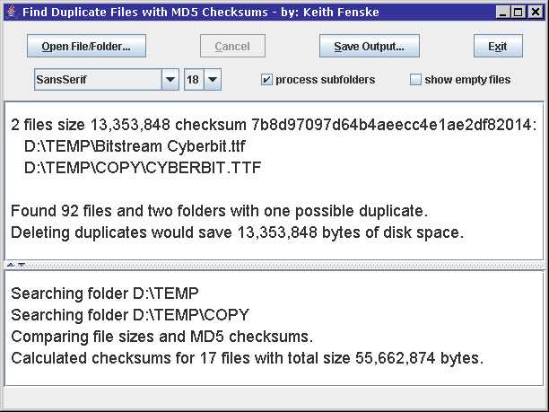

### Find Duplicate Files (Java)

by: Keith Fenske, https://kwfenske.github.io/

FindDupFiles is a Java 1.4 application to find duplicate files by searching for
files that have the same size and the same MD5 checksum. It won't find files
that are merely similar, such as two consecutive photos of the same subject, or
two MP3 songs encoded at different times. Possible duplicates are reported to
the user, who can then verify that the files are identical, either by
inspection or by doing a byte-by-byte comparison with the "comp" command on
DOS/Windows or the "cmp" command on Linux. What to do with files is the user's
choice; the program does nothing except report the duplicates. The probability
of two different files having the same size and MD5 checksum is extremely
small.

Download the ZIP file here: https://kwfenske.github.io/find-duplicate-files-java.zip

Released under the terms and conditions of the Apache License (version 2.0 or
later) and/or the GNU General Public License (GPL, version 2 or later).

